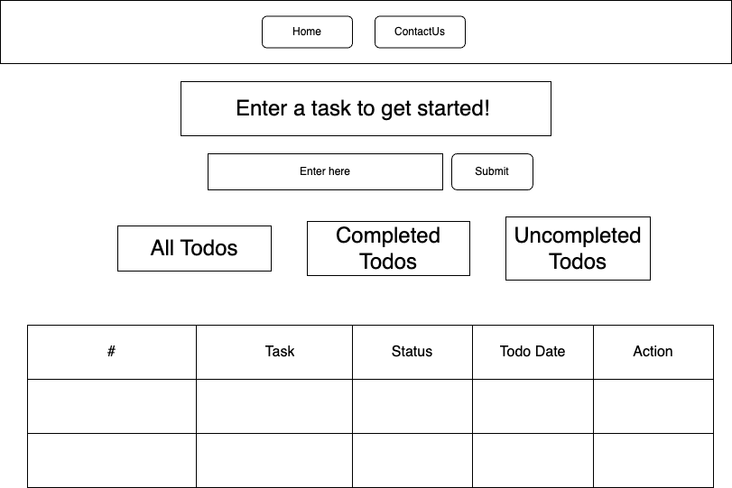
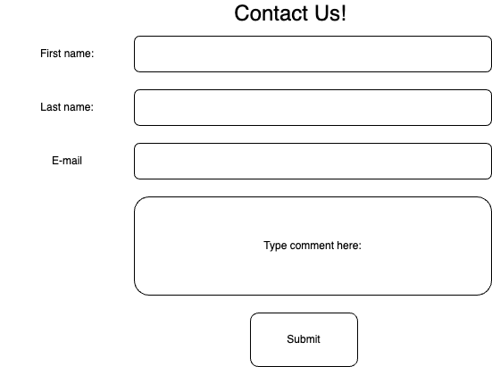

# Getting Started with Create React App
## Lydia Jarvis 
## Project 3-Overview

This project will allow users to create a Todo list of tasks needed to be completed and can mark the status of them as they go.

### Wireframes

Home Page:

Contact Page:

## User Stories:
- As a user, I want to be able to keep track of what tasks are completed and what tasks are not completed.
- As a user, I want to be able to delete tasks that are completed or was typed by mistake.
- As a user, I want to be able to see the due dates of all my tasks.

## Future Improvments:
- I would like to add more css
- A better understanding of what was happening behind th escreen
- I would like to be able to submit different tasks